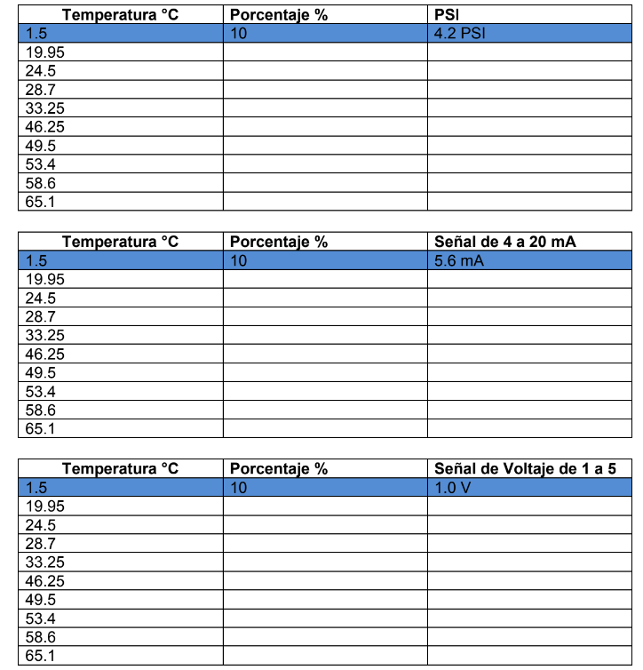
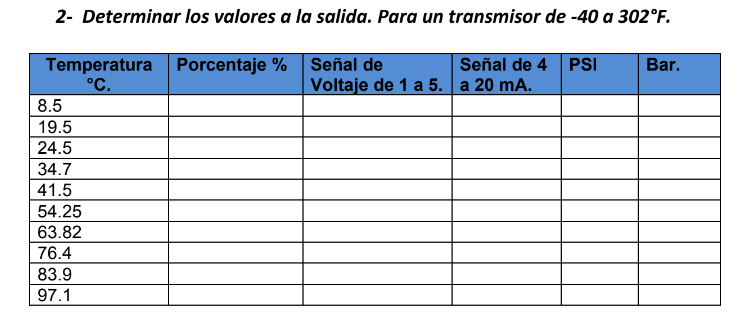

Importar la informacion a utilizar, las tablas de referencia, y los niveles de temperatura usados

```{r}
library(tidyverse)
df <- read.csv("data/reference-values.csv")
temperaturas <- read.csv("data/temperaturas.csv")
df
```

Funcion usada para realizar la interpolacion en las distintas tablas, para crear una generalizacion en estas damos por hecho el valor de los limites del transmisor hacia el ejercicio mas comun

```{r}
completar_tabla <- function(temperatura_col, df, columnas, start_10 = TRUE, transmisor = c(-30, 250)) {
    # Crear el DataFrame inicial
    if (start_10) {
        tabla <- data.frame(Temperatura = temperatura_col, 
                            Porcentaje = ((temperatura_col - transmisor[1]) / (transmisor[2] - transmisor[1])) * 100 * 10/11.25)
    } else {
        tabla <- data.frame(Temperatura = temperatura_col, 
                            Porcentaje = ((temperatura_col - transmisor[1]) / (transmisor[2] - transmisor[1])) * 100)
    }
    # Eliminar filas con NA
    tabla <- na.omit(tabla)
    
    # Agregar dinámicamente las columnas de interpolación
    for (columna in columnas) {
        nombre_columna <- rlang::sym(columna)
        tabla <- tabla %>%
            mutate(!!nombre_columna := approx(df$Porcentaje, df[[columna]], Porcentaje)$y)
    }
    
    return(tabla)
}
```

Ejercicio #1

Un transmisor que tiene las siguientes características. Rango de -30 a 250°F. Determinar la magnitud precisa de la señal de salida si fuese Neumática o Eléctrica. Para Obtener los porcentajes se empleó la ecuación. Porcentaje= (T-(Rango mínimo)) / ((Rango máximo-Rango mínimo)) \* 100

```{r}
ejercicio_1 <- completar_tabla(temperaturas$ex1, df, "Bar")
ejercicio_1
```

Complete las siguientes tablas



```{r}
tabla_1 <- completar_tabla(temperaturas$ex2, df, "psi")
tabla_1
```

```{r}
tabla_2 <- completar_tabla(temperaturas$ex3, df, "mA")
tabla_2
```

```{r}
tabla_3 <- completar_tabla(temperaturas$ex4, df, "V")
tabla_3
```



``` {.r .R}
```

```{r}
# Determinar los valores a la salida. Para un transmisor de -40 a 302°F.
ejercicio_2 <- completar_tabla(temperaturas$ex5, df, c("V", "mA", "psi", "Bar"), start_10 = FALSE, transmisor = c(-40, 302))
ejercicio_2
```

``` {.r .R}

```
